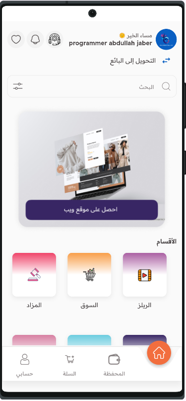
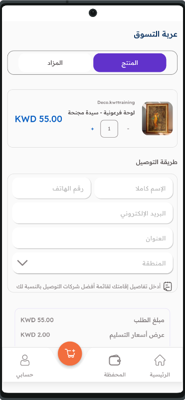
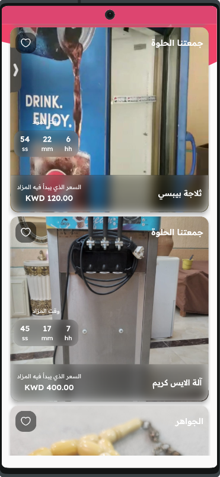
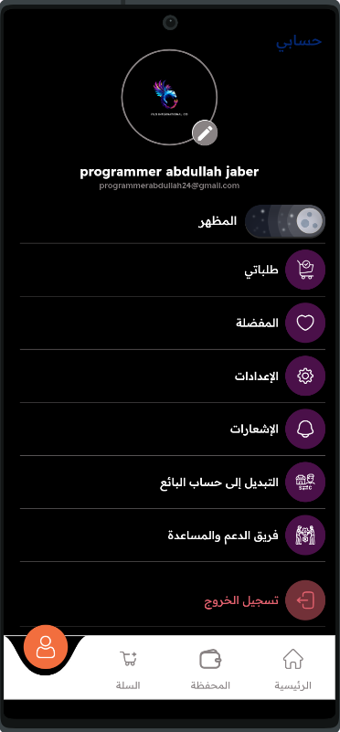
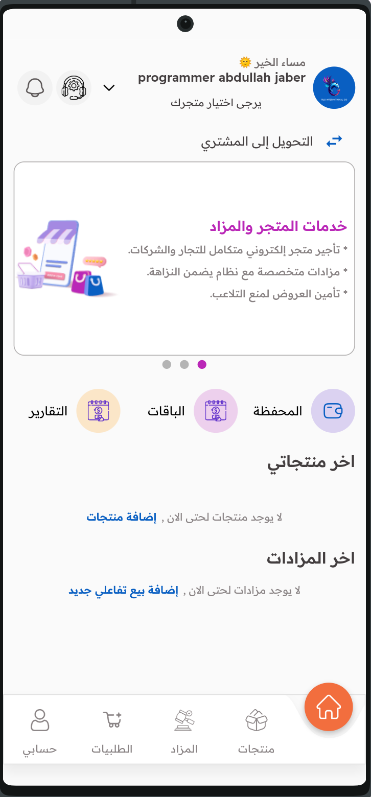

# fils

Fils is an innovative app that combines traditional shopping with live auctions and direct sales. You can buy products and pay directly through the app, as well as participate in live auctions and bid on products with ease. The app also allows you to send gifts and manage your digital wallet for seamless and secure transactions. Enjoy a unique shopping experience where interaction and fun come together!

## Getting Started

This project is a starting point for a Flutter application.

A few resources to get you started if this is your first Flutter project:

- [Lab: Write your first Flutter app](https://docs.flutter.dev/get-started/codelab)
- [Cookbook: Useful Flutter samples](https://docs.flutter.dev/cookbook)

For help getting started with Flutter development, view the
[online documentation](https://docs.flutter.dev/), which offers tutorials,
samples, guidance on mobile development, and a full API reference.

## Screenshots

### Home Screen

### C_Home Screen

### Cart Screen

### Auction Screen

### Reels Screen

### Haraj Screen

### Profile Screen

### Home Seller Screen

### Payment Screen

### Boot Screen
